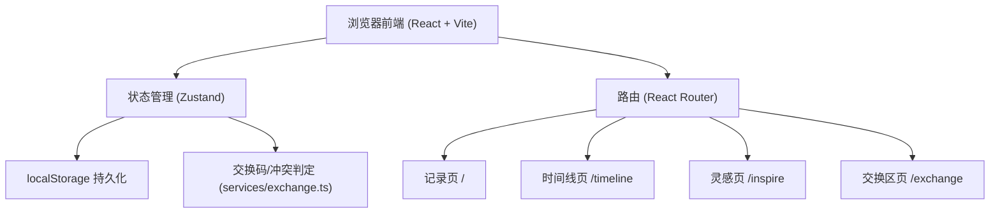
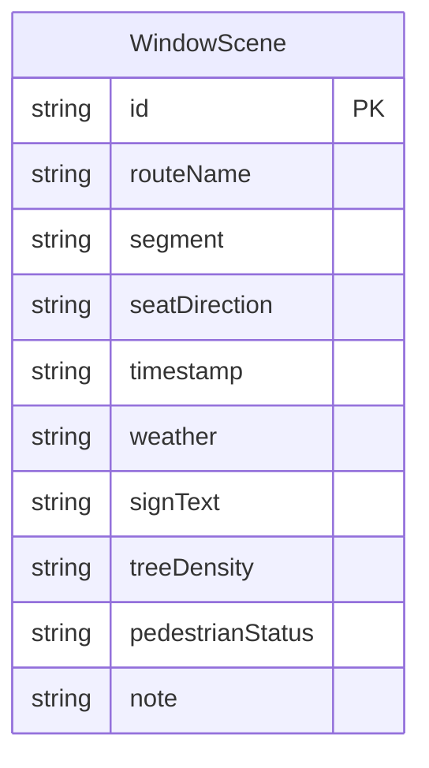

## 1. 架构设计



## 2. 技术说明

- **前端**：React@18 + Tailwind CSS@3 + Vite
- **初始化工具**：Vite (create-vite)
- **后端**：无（纯前端）
- **数据库**：localStorage（浏览器本地存储）

## 3. 路由定义

| 路由 | 用途 |
|------|------|
| / | 首页/记录页，填写窗景采样表单 |
| /timeline | 时间线页，按线路查看窗景记录 |
| /inspire | 灵感页，随机抽取窗景作为写作灵感 |
| /exchange | 本机交换区，生成/粘贴交换码、处理同编号分歧 |

## 3.1 分层维护

- `src/services/storage.ts` — **数据层**：localStorage 读写（正式记录、待处理区、路线统计）
- `src/services/exchange.ts` — **冲突判定层**（纯逻辑，不落库）：交换码编解码、记录合法性校验、内容一致性比较（`isSameScene`）、导入计划生成（`buildImportPlan`）
- `src/store/useSceneStore.ts` + `src/pages/ExchangePage.tsx` — **页面接入层**：编排数据层与判定层，渲染交换区界面
- 交换码格式：`BUSWSC1:` + UTF-8 Base64(JSON(WindowScene[]))

### 同编号导入规则

1. 编号相同且全部字段一致 → **跳过**，不制造副本；
2. 编号相同但采样时间 / 天气 / 笔记（及其它字段）不同 → 本地版本原样保留，外来版本进入**待处理区**，不直接顶掉；
3. 本地无此编号 → 作为新记录直接加入；
4. 待处理项可逐条「保留本地」或「采用对方」，处理后路线计数与最近采样时间立即重算。

## 4. API 定义
无后端 API，所有数据操作通过 localStorage 进行。

数据操作封装为独立的 service 层：
- `saveScene(scene)` — 保存窗景记录
- `getAllScenes()` — 获取所有记录
- `getScenesByRoute(routeName)` — 按线路筛选
- `getRandomScene()` — 随机获取一条记录
- `deleteScene(id)` — 删除记录
- `writeAllScenes(scenes)` — 整表写入（导入/冲突处理用）
- `getPendingConflicts()` / `writePendingConflicts(list)` — 待处理区读写
- `getRouteStats()` — 重算各路线计数与最近采样时间

exchange 层（纯逻辑）：
- `encodeExchangeCode(scenes)` / `decodeExchangeCode(code)` — 交换码编解码
- `isValidScene(value)` — 记录合法性校验
- `isSameScene(a, b)` — 同编号内容是否完全一致
- `buildImportPlan(localScenes, existingPending, incomingScenes)` — 生成「新增 / 跳过 / 冲突」导入计划
- store 动作：`generateExportCode()`、`importExchangeCode(code)`、`resolveConflict(id, 'local' | 'incoming')`

## 5. 服务器架构
不适用

## 6. 数据模型

### 6.1 数据模型定义



### 6.2 数据定义

localStorage 键：`bus_window_scenes`

数据结构：
```typescript
interface WindowScene {
  id: string;
  routeName: string;
  segment: string;
  seatDirection: "左" | "右";
  timestamp: string;
  weather: "晴" | "多云" | "阴" | "小雨" | "大雨" | "雪" | "雾";
  signText: string;
  treeDensity: "稀疏" | "适中" | "茂密";
  pedestrianStatus: "稀少" | "零星" | "密集";
  note: string;
}
```

存储格式：`WindowScene[]` 的 JSON 序列化字符串

### 6.3 待处理区

localStorage 键：`bus_window_scenes_pending`

```typescript
interface PendingConflict {
  id: string                 // 与 WindowScene.id 相同（记录编号）
  local: WindowScene         // 本地版本
  incoming: WindowScene      // 外来版本
  createdAt: string          // 首次进入待处理区的时间
}
```
