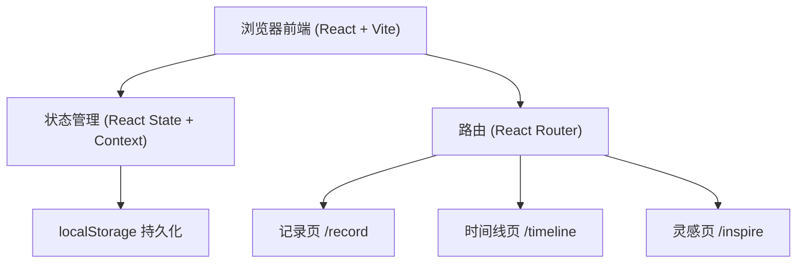
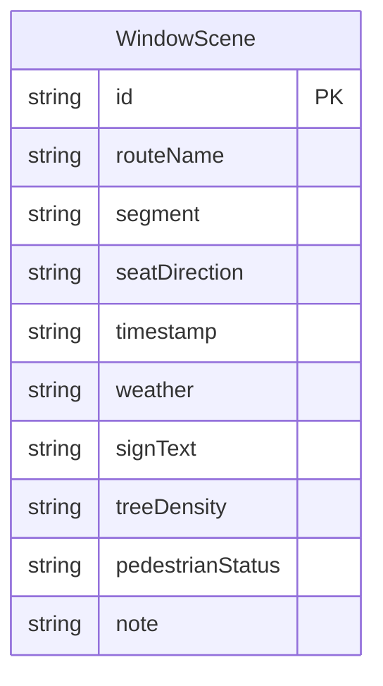

## 1. 架构设计



## 2. 技术说明

- **前端**：React@18 + Tailwind CSS@3 + Vite
- **初始化工具**：Vite (create-vite)
- **后端**：无（纯前端）
- **数据库**：localStorage（浏览器本地存储）

## 3. 路由定义

| 路由 | 用途 |
|------|------|
| / | 首页/记录页，填写窗景采样表单 |
| /timeline | 时间线页，按线路查看窗景记录 |
| /inspire | 灵感页，随机抽取窗景作为写作灵感 |
| /exchange | 本机交换区，生成/导入交换码，处理同编号冲突 |

## 4. API 定义
无后端 API，所有数据操作通过 localStorage 进行。

数据操作封装为独立的 service 层：
- `saveScene(scene)` — 保存窗景记录
- `getAllScenes()` — 获取所有记录
- `getScenesByRoute(routeName)` — 按线路筛选
- `getRandomScene()` — 随机获取一条记录
- `deleteScene(id)` — 删除记录
- `getAllPending() / upsertPending() / removePending()` — 待处理区读写
- `addScenes(scenes)` — 导入时批量追加新编号记录
- `replaceScene(scene)` — 采用对方版本时按编号整体替换
- `getRouteStats()` — 实时聚合各路线计数与最近采样时间

本机交换区按三层分离维护：
- **数据层** `services/storage.ts`：主记录与待处理区各自独立的 localStorage 键
- **交换码层** `services/exchange.ts`：`encodeScenes()` 生成 `BWS1:` 前缀 + UTF-8 安全 base64；`decodeExchangeCode()` 负责解码、版本与字段校验
- **冲突判定层** `utils/conflict.ts`：纯函数 `classifyImport()` / `isSameContent()` / `diffFields()`，不碰存储

导入规则（同编号以 `id` 匹配）：
1. 本机无同编号 → 直接追加为新记录
2. 同编号且内容完全一致 → 跳过，不重复制造副本
3. 同编号但采样时间/天气/笔记等任一字段不同 → 本地版本留在主记录，对方版本单独进入待处理区，绝不顶掉
4. 待处理项可逐条「保留本地」（仅移除待处理项）或「采用对方」（整体替换主记录），处理后路线计数与最近采样时间立即重算

## 5. 服务器架构
不适用

## 6. 数据模型

### 6.1 数据模型定义



### 6.2 数据定义

localStorage 键：`bus_window_scenes`

数据结构：
```typescript
interface WindowScene {
  id: string;
  routeName: string;
  segment: string;
  seatDirection: "左" | "右";
  timestamp: string;
  weather: "晴" | "多云" | "阴" | "小雨" | "大雨" | "雪" | "雾";
  signText: string;
  treeDensity: "稀疏" | "适中" | "茂密";
  pedestrianStatus: "稀少" | "零星" | "密集";
  note: string;
}
```

存储格式：`WindowScene[]` 的 JSON 序列化字符串

待处理区 localStorage 键：`bus_window_scenes_pending`

数据结构：
```typescript
interface PendingConflict {
  id: string;              // 与主记录相同的记录编号
  local: WindowScene;      // 导入时的本地版本快照
  incoming: WindowScene;   // 交换码中的对方版本
  importedAt: string;      // 进入待处理区的时间
  fromDevice: string;      // 来源设备标识
}
```

交换码格式：`BWS1:` + base64(UTF-8(JSON))，载荷为
`{ version: 1, device, exportedAt, scenes: WindowScene[] }`。
设备标识存于 `bus_window_device_id`，仅用于待处理项标注来源。
